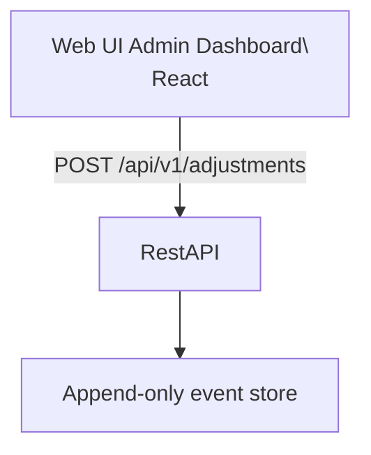

# Adjustment Event API

**Status: DRAFT — not published.** This contract is under review and not yet
versioned as a published interface. Breaking changes may still be made without
a new version folder.

Backend API contract for the Web dashboard to append manual correction events
to the append-only event store. Adjustments correct the real state shown on
dashboards and in reports without modifying or deleting any recorded history.

## Architecture

## Endpoints

- `POST /api/v1/adjustments` - Append an [AdjustmentEvent] to the event store

## Implementation Notes

**Adjustments are events, not mutations.** An adjustment is appended to the
same append-only store as connection and shift events (see the Positioning
Ingestion contract). There is no update or delete path anywhere in the system:
history is never rewritten, and the "real state" is defined as the projection
that accounts for adjustments.

**Chained adjustments.** `target_event_id` may reference another adjustment:
if an adjustment is itself wrong, it is corrected by appending a new
adjustment, never by editing the previous one.

**Audit criteria.** Every write to the store carries `actor`, `author`,
`source`, and a server-generated `server_timestamp`. `reason` is mandatory:
this store is contractual evidence of compliance (see ADR 0002), so the
justification travels with the correction.

**Authorization.** `author` identifies the admin performing the correction
and is taken from the authenticated dashboard session, not from the request
body.

## Data Models

### AdjustmentEvent (request)

- `actor`: UUID — the steward (android device) the adjustment is about
- `corrected_fact`: [CorrectedFact] object that is the new, adjusted event.
- `reason`: string — mandatory human-readable justification
- `author`: UUID — the admin who performed the adjustment (from session)

### AdjustmentEvent (response)

All request fields, plus:

- `adjustment_id`: UUID — server-generated identifier of the appended event
- `server_timestamp`: date-time — when the backend recorded the adjustment, UTC
  in ISO 8601 with offset

### CorrectedFact

- `fact_type`: enum `"connect"` | `"disconnect"` | `"shift_start"` |
  `"shift_stop"` — the event that actually happened
- `beacon_id`: UUID — required when `fact_type` is `connect` or `disconnect`,
  null otherwise
- `occurred_at`: date-time — when the corrected fact actually happened
