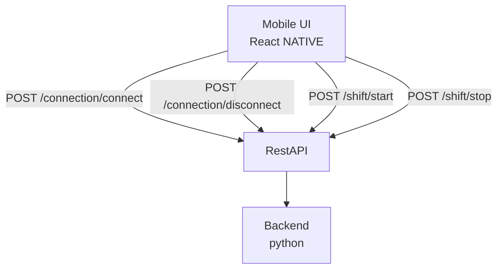

# Positioning Ingestion API

Backend API contract for Android client to ingest connection and shift events for positioning data.

## Architecture

## Endpoints

- `POST /connection/connect` - Report connection established ([ConnectionEvent])
- `POST /connection/disconnect` - Report connection lost ([ConnectionEvent])
- `POST /shift/start` - Report shift started ([ShiftEvent])
- `POST /shift/stop` - Report shift stopped ([ShiftEvent])

## Implementation Notes

All endpoints use POST to maintain an append-only event log. Stewards press "start" and "stop" when taking breaks; during "stop" periods they cannot be tracked by beacons, so explicit logging is required.

## Data Models

### ConnectionEvent
- `android_id`: UUID
- `beacon_id`: UUID
- `status`: fixed per endpoint ("CONNECT" or "DISCONNECT")

### ShiftEvent
- `android_id`: UUID
- `status`: fixed per endpoint ("START" or "STOP")
