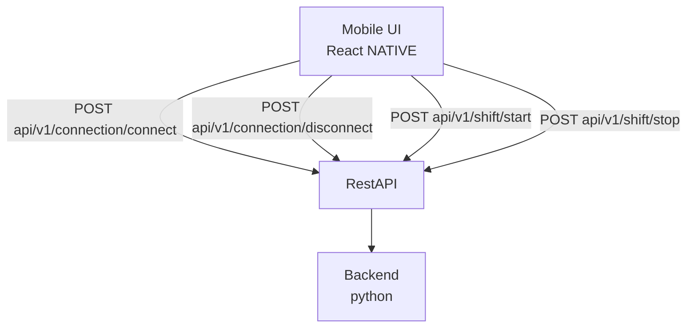

# Positioning Ingestion API

Backend API contract for Android client to ingest connection and shift events for positioning data.

## Architecture

## Endpoints

- `POST api/v1/connection/connect` - Report connection established ([ConnectionEvent])
- `POST api/v1/connection/disconnect` - Report connection lost ([ConnectionEvent])
- `POST api/v1/shift/start` - Report shift started ([ShiftEvent])
- `POST api/v1/shift/stop` - Report shift stopped ([ShiftEvent])

## Implementation Notes

All endpoints use POST to maintain an append-only event log. Stewards press "start" and "stop" when taking breaks; during "stop" periods they cannot be tracked by beacons, so explicit logging is required.

Each endpoint corresponds to exactly one action, so event payloads no longer carry a `status` field — the action is implied by which endpoint was called (this replaces v1's combined `/connection-event` and `/shift-event` endpoints).

## Data Models

### ConnectionEvent
- `android_id`: UUID
- `beacon_id`: UUID
- `timestamp`: Date — when the connection or disconnection occurred on the device

### ShiftEvent
- `id`: UUID (android)
