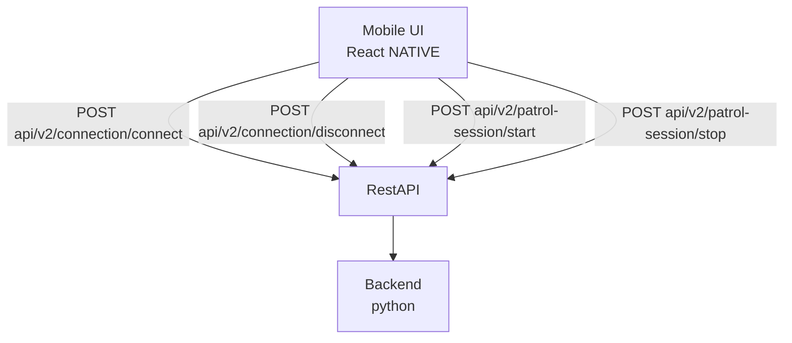

# Positioning Ingestion API

Backend API contract for Android client to ingest connection and patrol session events for positioning data.

## Architecture

```mermaid
graph TD
    MobileUI[Mobile UI\nReact NATIVE] -->|POST api/v2/connection/connect| RestAPI
    MobileUI -->|POST api/v2/connection/disconnect| RestAPI
    MobileUI -->|POST api/v2/patrol-session/start| RestAPI
    MobileUI -->|POST api/v2/patrol-session/stop| RestAPI
    RestAPI[RestAPI] --> Backend[Backend\npython]
```

## Endpoints

- `POST api/v2/connection/connect` - Report connection established ([connection-event])
- `POST api/v2/connection/disconnect` - Report connection lost ([connection-event])
- `POST api/v2/patrol-session/start` - Report patrol session started ([patrol-session-event])
- `POST api/v2/patrol-session/stop` - Report patrol session stopped ([patrol-session-event])

## Implementation Notes

All endpoints use POST to maintain an append-only event log. Stewards press "start" and "stop" when taking breaks; during "stop" periods they cannot be tracked by beacons, so explicit logging is required.

Each endpoint corresponds to exactly one action, so event payloads no longer carry a `status` field — the action is implied by which endpoint was called (this replaces v1's combined `/connection-event` and `/patrol-session-event` endpoints).

## Data Models

### connection-event
- `android_id`: UUID
- `beacon_id`: UUID
- `timestamp`: Date — when the connection or disconnection occurred on the device

### patrol-session-event
- `id`: UUID (android)
- `timestamp`: Date — when the connection or disconnection occurred on the device
