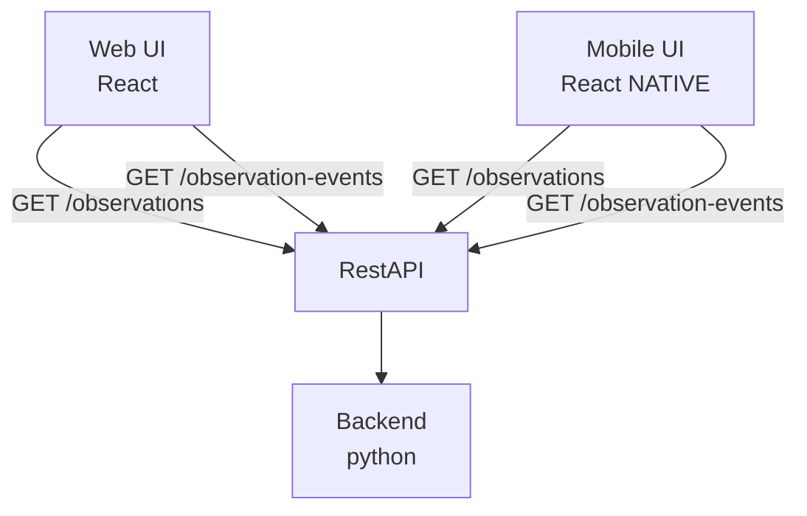

# Positioning Interface API

Backend API contract for station presence positioning data. Consumed by frontend, dashboard, and reporting services.

## Architecture

## Endpoints

- `GET /observations` - Returns currently observed areas ([AreaObservation])
- `GET /observation-events` - Stream of observation events ([ObservationEvent])

## Implementation Notes

The `/observation-events` endpoint supports real-time push via WebSocket (`/ws/observation-events`) or Server-Sent Events, allowing consumers to receive OBSERVED/NOT_OBSERVED events without polling.

## Data Models

### AreaObservation
- `beacon_id`: UUID (beacon)
- `area_type`: enum (train | concourse | platform)
- `slug`: string
- `timestamp`: Date

### ObservationEvent
- `beacon_id`: UUID
- `timestamp`: Date
- `event_type`: enum ("OBSERVED" | "NOT_OBSERVED")
