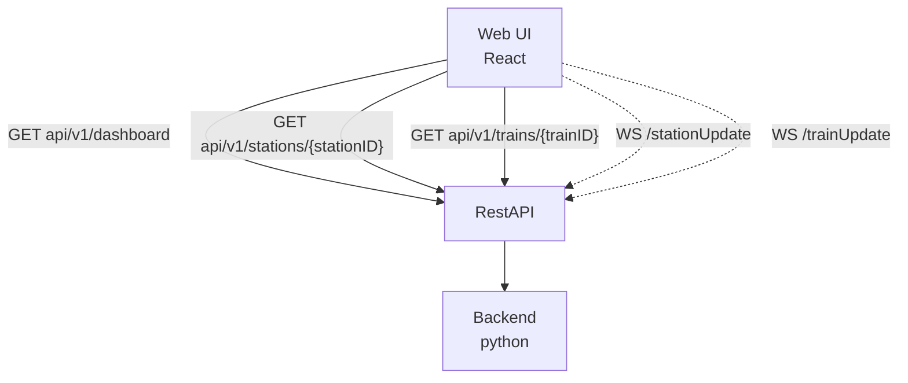

# Positioning Interface API

Backend API contract for station and train presence positioning data. Consumed by the Web UI dashboard and reporting services.

## Architecture

## Endpoints

- `GET api/v1/dashboard` - Returns every station and train ([DashboardResponse])
- `GET api/v1/stations/{stationID}` - Returns a single station and its areas ([StationResponse])
- `GET api/v1/trains/{trainID}` - Returns a single train ([TrainResponse])
- `WS /stationUpdate` - Live push of a [StationResponse] whenever a station's manning state changes
- `WS /trainUpdate` - Live push of a [TrainResponse] whenever a train's manning state changes

## Implementation Notes

`/stationUpdate` and `/trainUpdate` are WebSocket channels, not polled REST resources. The backend pushes the same payload shape as the corresponding `GET` endpoint whenever a connection event (see the Positioning Ingestion contract) changes who is manning a station area or train, replacing v1's pollable `/observation-events` stream.

The exact relationship between `StationResponse`/`TrainResponse` and the underlying `Station`/`Train` entities is intentionally left open for a later sprint — this contract fixes the interface, not the implementation.

## Data Models

### Train
- `train_id`: UUID
- `beacon_id`: UUID
- `slug`: string
- `total_time_secs`: integer
- `manned_time_secs`: integer
- `current_steward_id`: steward_id[]

### Station
- `station_id`: UUID
- `slug`: string
- `areas`: StationArea[]
- `station_name`: string

### StationArea
- `beacon_id`: UUID
- `slug`: string
- `last_manned_at`: Date
- `current_steward_id`: steward_id[]
- `area_type`: enum `"platform"` | `"concourse"`

### DashboardResponse
- `stations`: Station[]
- `trains`: Train[]

### StationResponse
- Same shape as `Station`

### TrainResponse
- Same shape as `Train`
